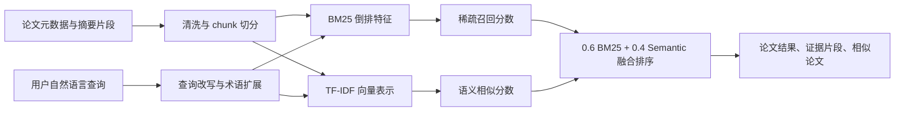

# 面向 IR/RAG 研究的学术论文检索与证据问答系统设计

学号：__________　姓名：__________

## 背景与意义

随着大语言模型和检索增强生成（Retrieval-Augmented Generation, RAG）技术的发展，信息检索领域的研究资料呈现快速增长趋势。对刚进入相关方向的学生而言，常见的信息需求并不是简单地查找某一篇论文，而是希望围绕一个问题理解方法脉络，例如“BM25 和向量检索如何结合”“RAG 如何缓解幻觉”“查询改写在检索中有什么作用”。传统搜索引擎虽然覆盖面广，但返回结果往往以标题和网页摘要为主，难以直接呈现论文之间的方法关系、关键证据片段和可引用依据。

本设计提出一个面向 IR/RAG 研究入门者的学术论文检索与证据展示系统 Academic Evidence Finder。系统不追求大规模生产级检索，而是以可解释、轻量、可演示为目标，围绕课程作业展示一个完整的信息检索流程：论文语料构建、文本清洗与切分、索引构建、查询理解、混合召回、排序融合、证据片段展示和检索评价。该设计的意义在于把抽象的信息检索理论转化为一个可观察的产品原型，使用户不仅能看到“检索到了什么”，还能理解“为什么这些论文被排在前面”。

## 现状分析

现有学术检索产品包括 Google Scholar、Semantic Scholar、arXiv Search 等。Google Scholar 的优势是覆盖面广、引用信息丰富，但检索结果解释较弱，用户很难直接比较不同论文在具体技术问题上的关联。Semantic Scholar 提供论文卡片、引用网络和部分语义能力，但对特定课程方向的轻量定制不足。arXiv Search 更适合查找预印本，但排序和结果摘要仍以关键词匹配为主。

从技术角度看，传统稀疏检索以 BM25 为代表，优点是高效、可解释、对术语和实体匹配敏感，缺点是容易受到词汇不匹配影响。稠密检索通过向量表示捕捉语义相似性，可以缓解同义表达问题，但在零样本场景中并不总是稳定，也可能忽略精确术语。近年来 RAG 系统通常把检索模块与生成模块结合，用外部知识减少模型幻觉并提升答案可追溯性。然而在课程 demo 中直接接入大模型和大规模向量库会带来依赖复杂、资源占用高和提交文件过大的问题。

因此，本系统采用折中方案：用 BM25 体现经典信息检索思想，用 TF-IDF 向量余弦相似度模拟轻量语义检索，用字段权重、短语/主题 boost 和 MMR 去冗余实现可解释重排序，并把证据片段显式展示给用户。该方案规模可控、实现透明，适合作为课程作业的功能设计与演示原型。

## 方案设计

系统整体框架分为六层：数据层、预处理层、索引层、查询层、排序层和展示层。

数据层使用本地 JSON 语料文件，当前包含约 70 篇经典 IR、神经检索、RAG、评测基准和 2024 年代表性 RAG 论文。每篇论文包含标题、作者、年份、会议、主题标签、链接、摘要和若干证据片段。预处理层将标题、摘要、主题和片段合并为可检索文本，并进行英文分词、大小写归一、简单复数归一和停用词过滤。考虑到中文用户会输入“幻觉”“混合检索”“查询改写”等问题，系统加入一个轻量中文术语映射表，把中文关键词扩展为 hallucination、hybrid retrieval、query rewriting 等英文检索词。

索引层同时构建两类表示：一类是 BM25 所需的词频、文档频率和文档长度统计；另一类是 TF-IDF 向量，用余弦相似度衡量查询与论文之间的语义近似程度。排序层支持三种模式：仅 BM25、仅 Semantic 和 Hybrid。Hybrid 模式首先融合 BM25、TF-IDF cosine 和字段权重分数，再根据标题/主题中的短语命中、主题意图匹配、证据片段覆盖度进行轻量重排序，最后使用 MMR 降低 top results 中的主题重复。展示层被设计为检索工作台：包含推荐查询、语料规模、筛选器、结果分数条、排序原因、证据高亮、详情页和相似论文。

## 技术路线

后端提供四个核心接口：`/api/search` 用于检索，`/api/papers/{id}` 用于论文详情，`/api/topics` 用于筛选项，`/api/evaluate` 用于输出评价结果。为了降低部署门槛，默认服务器使用 Python 标准库实现，无需联网安装依赖；同时保留 FastAPI 包装层，便于在依赖可用时切换为更标准的 Web API 服务。

检索流程如下。首先，系统接收用户 query，并根据中文术语映射表进行查询扩展。例如“RAG 如何缓解幻觉”会扩展出 retrieval augmented generation、hallucination、faithfulness、evidence 等词。其次，BM25 模块计算查询词在文档中的概率相关分数，突出术语精确命中。再次，TF-IDF 向量模块计算查询向量与论文向量的余弦相似度，补充语义近似匹配。最后，Hybrid 模式对 BM25、TF-IDF cosine、字段权重、短语 boost、主题 boost 和证据覆盖度进行融合，并用 MMR 去冗余返回排序后的论文列表。

证据片段选择采用轻量规则：系统在摘要和 chunk 中寻找与查询词重叠最多的文本片段，将其作为 evidence 返回，并对命中词进行高亮。每条检索结果还返回 matched phrases、topic match 和 ranking reasons，用于解释该论文为什么被排在前面。这种方式虽然不如大模型生成摘要灵活，但具有可解释、低成本和可复现的优点。相似论文推荐则基于论文之间的 TF-IDF 向量余弦相似度，帮助用户沿着同一主题继续阅读。

评价部分准备了多个典型查询，并为每个查询人工标注多篇相关论文，分别计算 Precision@5、Recall@10 和 MRR。系统比较 BM25、Semantic 和 Hybrid 三种模式，观察不同检索策略在术语型问题、语义型问题、中文查询、GraphRAG、SPLADE 等场景下的表现差异。该评价不追求大规模统计显著性，而是服务于课程 demo，说明系统具备基本检索效果和可分析性。

## 总结

Academic Evidence Finder 面向 IR/RAG 研究学习场景，设计了一个轻量但完整的学术论文检索系统。与普通关键词搜索相比，系统增加了查询改写、混合检索、证据片段和相似论文推荐；与复杂 RAG 系统相比，系统避免依赖大型模型和外部服务，便于本地运行、课程展示和结果复现。

本设计的核心价值在于可解释性和教学性：用户可以看到每个结果的 BM25 分数、语义分数和证据片段，理解不同检索策略的优缺点。后续如果继续扩展，可以将 TF-IDF 向量替换为 Sentence-BERT，将本地 JSON 语料替换为真实 PDF 解析结果，并在生成答案时加入引用约束和事实一致性检测。

## 参考文献

[1] S. Robertson and H. Zaragoza. The Probabilistic Relevance Framework: BM25 and Beyond. Foundations and Trends in Information Retrieval, 2009.

[2] P. Lewis et al. Retrieval-Augmented Generation for Knowledge-Intensive NLP Tasks. NeurIPS, 2020.

[3] V. Karpukhin et al. Dense Passage Retrieval for Open-Domain Question Answering. EMNLP, 2020.

[4] N. Thakur et al. BEIR: A Heterogeneous Benchmark for Zero-shot Evaluation of Information Retrieval Models. NeurIPS Datasets and Benchmarks, 2021.

[5] A. Asai et al. Self-RAG: Learning to Retrieve, Generate, and Critique through Self-Reflection. ICLR, 2023.

[6] R. Nogueira, Z. Jiang, and J. Lin. Document Ranking with a Pretrained Sequence-to-Sequence Model. Findings of EMNLP, 2020.

[7] Y. Gao et al. Retrieval-Augmented Generation for Large Language Models: A Survey. arXiv, 2023.
